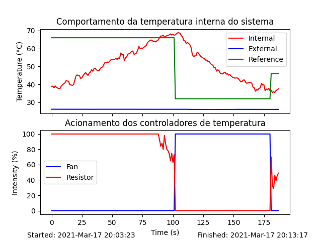

# Projeto 1 - 2020/2

Projeto 1 da disciplina de Fundamentos de Sistemas Embarcados (2020/2)

O enunciado do projeto 1 pode ser acessado em https://gitlab.com/fse_fga/projetos_2020_2/projeto-1-2020.2

## Objetivo
O projeto se trata da implementação de um sistema de controle de temperatura utilizando conceitos como UART, I2C e GPIO. Foi configurado um ambiente controlado que possui um resistor para aumento de temperatura interna e uma ventoinha para diminuição da temperatura interna.

Após receber um valor de temperatura alvo, o código implementado neste repositório irá realizar a leitura de sensores e o operar o controle do resistor e da ventoinha para garantir que a temperatura se estabilize de forma mais precisa possível ao valor informado.

Ao final da execução do programa, que deve ser informado pelo usuário, o programa ira gerar um log de informações como data/hora, temperatura interna e externa, e intensidade da ventoinha e do resistor. Além disso, será criado um gráfico para análise do comportamento da temperatura do ambiente fechado.

## Como executar o programa
Para executar o programa, basta inserir o comando
```
    make run
```

## Exemplo de resultado
O gráfico a seguir foi gerado ao se realizar um experimento com este programa:



Nota: A leitura do sensor de temperatura interna possuia ruídos, e o resistor não aquecia rapidamente.